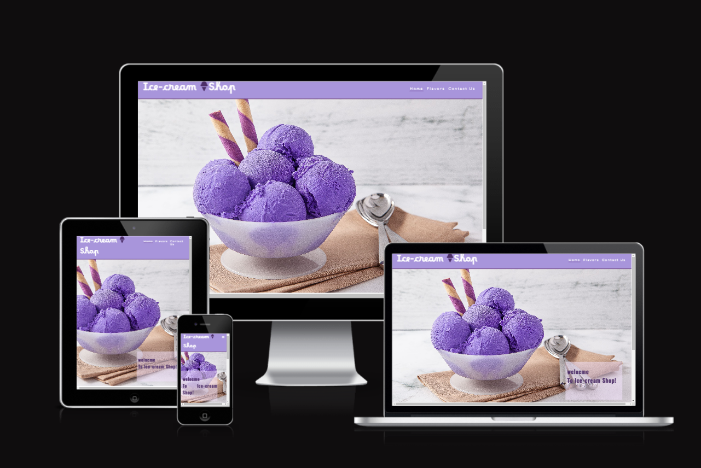

# Ice-Cream shop

 Ice-Cream Shop is a site that helps people who live in kabul to find the best quality and testy ice-cream. this site motivates them to visit our shop. 
User of this website will be able to find all the information they need to know about Ice-Cream shop. About the pricing, flavors and conatct with us. 

## Features 

- __Navigation Bar__

  - Featured at the top of the page, the navigation shows the Ice-Cream shop name in the left corner. Ice-Cream Shop that links to the top of the page.
  - The other navigation links are to the right : Home, Flavors and contact which link to different section of the same page.
  - The navigation cleraly tells the user the name of the shop and website and makes the different secton of the information.

- __Home page__

  - The home page picture of testy ice-cream with welcome message.
  

- __Team__

  - This section shows our team with their positin.

- __The Footer__ 

  - The footer section includes links to the relevant social media sites for Ice-Cream Shop. The links will open to a new tab to allow easy navigation for the user. 
  - The footer is valuable to the user as it encourages them to keep connected via social media

- __Flavor page__

  - The Flavors page will allow the user to see different kind of ice-creams with different tests.
  - This section shows information user need to know about prices.
  

- __Contact Us__

  - The contact is vauable to the user as it gives them the ability to contact with ice-cream shop.

## Testing 

-  I confirmed that this project is responsive. looks good and function on all stndard screen szes using the devtools device toolbar.
- I confirmed that the navigation, header, Flavors,and conatct  text are all readable and easy to understand.

## Bugs

### solved bugs
- I discoverd that my project when the  width is smaller, horizontal scrollbar appeared.
- fixed the problem.

- html, body {
  overflow-x: hidden;
}
body {
  width: 1005;
}
### Validator Testing 

- HTML
  - No errors were returned when passing through the official W3C validator.
- CSS
  - No errors were found when passing through the official (Jigsaw) validator.
  
  

### Unfixed Bugs

No unfixed bugs

## Deployment
 

- The site was deployed to GitHub pages. The steps to deploy are as follows: 
  - In the GitHub repository, navigate to the Settings tab 
  - From the source section drop-down menu, select the Master Branch
  - Once the master branch has been selected, the page will be automatically refreshed with a detailed ribbon display to indicate the successful deployment. 

The live link can be found here - https://limazurmati.github.io/ice-cream--shop/

## Credits 
 

### Content 

- by help of w3school and love-running
- The icons in the footer were taken from [Font Awesome](https://fontawesome.com/)

### Media

- The photos used on the home and sign up page are from This Open Source site
- The images used for the flavors page were taken from this other open source site

