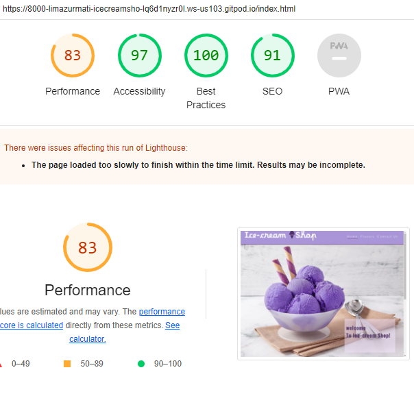
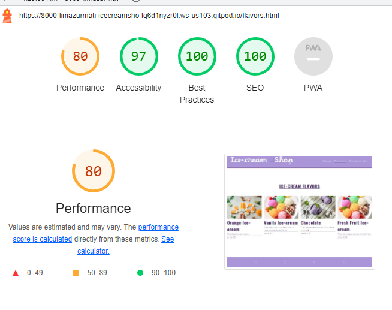

# The Ice-Cream Shop-  Testing

Visit the deployed site: [Ice-Cream Shop](https://limazurmati.github.io/ice-cream--shop/)

- - -

## CONTENTS

* [AUTOMATED TESTING](#automated-testing)
  * [W3C Validator](#w3c-validator)
  * [Lighthouse](#lighthouse)

Testing was ongoing throughout the entire build. I utilised Chrome developer tools whilst building to pinpoint and troubleshoot any issues as I went along.

During development I made use of google developer tools to ensure everything was working correctly and to assist with troubleshooting when things were not working as expected.gi

I have gone through each page using google chrome developer tools & Firefox inspector tool to ensure that each page is responsive on a variety of different screen sizes and devices.

- - -

## AUTOMATED TESTING

### W3C Validator

[W3C](https://validator.w3.org/) was used to validate the HTML on all pages of the website. It was also used to validate the CSS.

* [index.html](assets/testing/indexx.PNG) - Passed.
* [flavors.html](assets/testing/flavors2.PNG) - No errors
* [contact.html](assets/testing/Contact1.PNG) - Passed.
* [style.css](assets/testing/Css.PNG) - Passed, no errors found.

- - -

### Lighthouse

I used Lighthouse within the Chrome Developer Tools to test the performance, accessibility, best practices and SEO of the website.

### Desktop Results

All pages of the site are achieving a score of 100 across the 4 categories.

### Mobile Results

Each page is achieving a score of 100 for the last three categories. 

## MANUAL TESTING

- - -
`Home Page`

| Feature | Expected Outcome | Testing Performed | Result | Pass/Fail |
| --- | --- | --- | --- | --- |
| The Sites title | Link directs the user back to the home page | Clicked title | Home page reloads | Pass |
| Navigation | Link to the flavors and contact page | Clicked on link | New page with different information | Pass |
| Home page image| Attract user attention to page| Shows welcome message | Nice view | Pass |
| Team section| Directs the user to the team members | Read information about the team | Can contact with them| Pass |

`flavor Page`

| Feature | Expected Outcome | Testing Performed | Result | Pass/Fail |
| --- | --- | --- | --- | --- |
| The Sites title | Link directs the user back to the home page | Clicked title | Home page reloads | Pass |
| Ice-Cream images | Shows kind of ice-cream | Read text| To know about the test| Pass |

`conatct Page`

| Feature | Expected Outcome | Testing Performed | Result | Pass/Fail |
| --- | --- | --- | --- | --- |
| The Sites title | Link directs the user back to the home page | Clicked title | Home page reloads | Pass |
| form | write name and message | click on the box | send data by cliking button | Pass |
