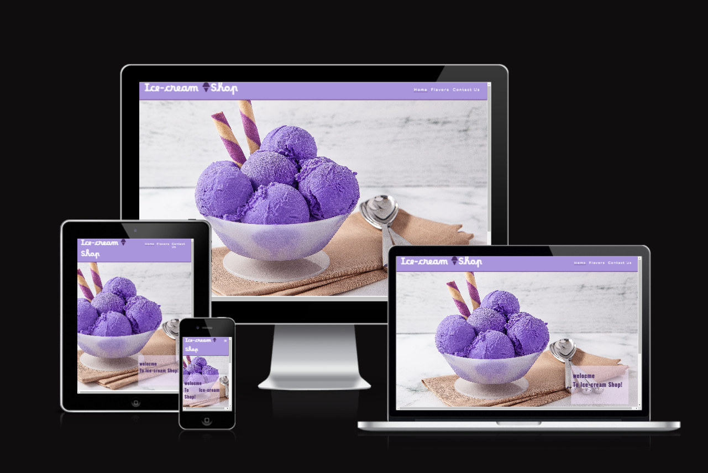
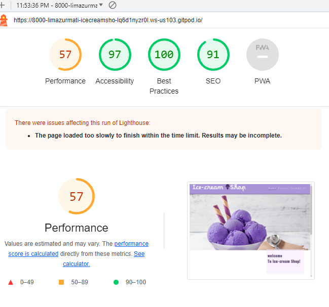
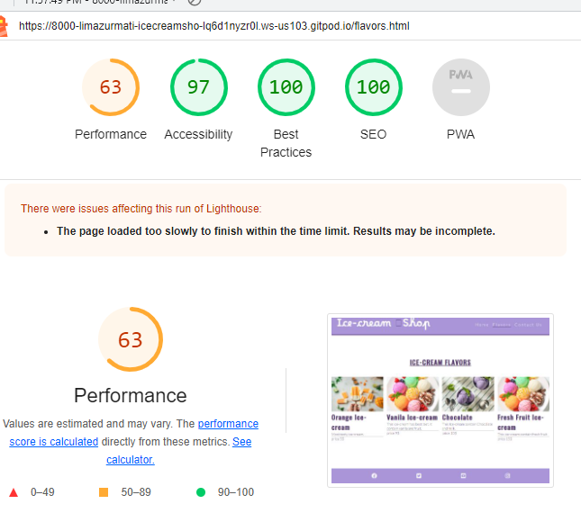
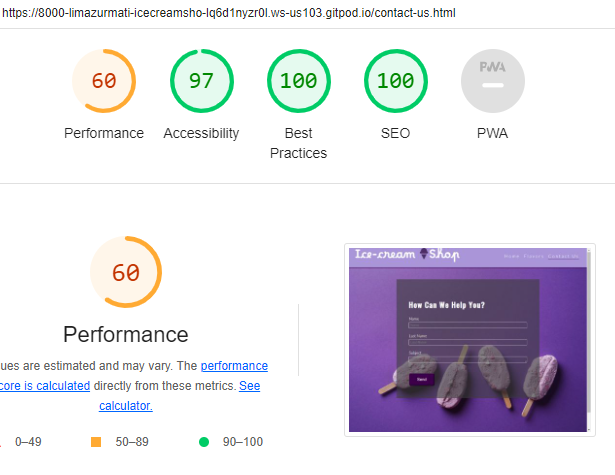
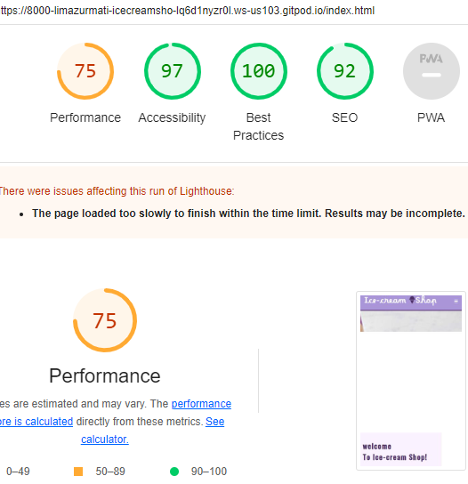
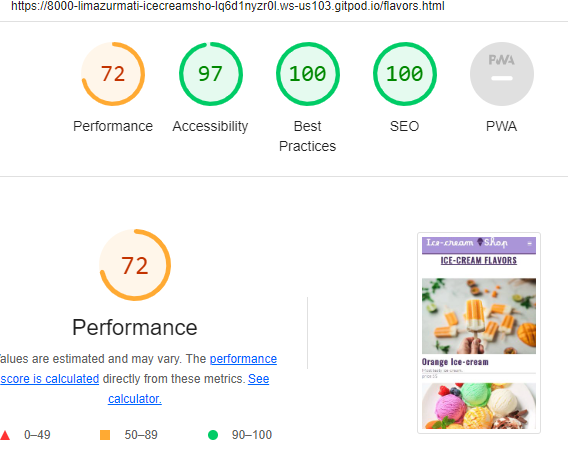
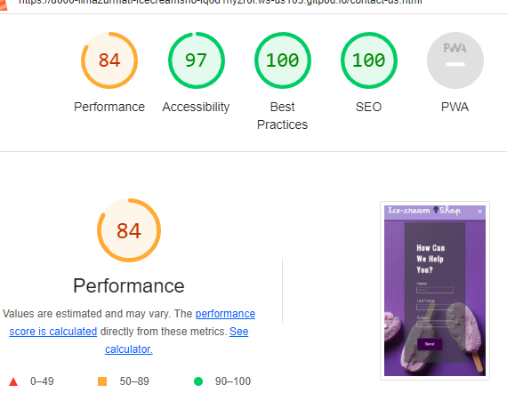

# The Ice-Cream Shop-  Testing

Visit the deployed site: [Ice-Cream Shop](https://limazurmati.github.io/ice-cream--shop/)

- - -

## CONTENTS

* [AUTOMATED TESTING](#automated-testing)
  * [W3C Validator](#w3c-validator)
  * [Lighthouse](#lighthouse)

Testing was ongoing throughout the entire build. I utilised Chrome developer tools whilst building to pinpoint and troubleshoot any issues as I went along.

During development I made use of google developer tools to ensure everything was working correctly and to assist with troubleshooting when things were not working as expected.

I utilised the console in the developer tools to work through small sections of JavaScript and ensure that the code was working, and also to troubleshoot where issues were.

I have gone through each page using google chrome developer tools & Firefox inspector tool to ensure that each page is responsive on a variety of different screen sizes and devices.

- - -

## AUTOMATED TESTING

### W3C Validator

[W3C](https://validator.w3.org/) was used to validate the HTML on all pages of the website. It was also used to validate the CSS.

* [index.html](assets/testing/indexx.PNG) - Passed.
* [flavors.html](assets/testing/flavors2.PNG) - No errors
* [contact.html](assets/testing/Contact1.PNG) - Passed.
* [style.css](assets/testing/Css.PNG) - Passed, no errors found.

- - -

### Lighthouse

I used Lighthouse within the Chrome Developer Tools to test the performance, accessibility, best practices and SEO of the website.

### Desktop Results

All pages of the site are achieving a score of 100 across the 4 categories.

### Mobile Results

Each page is achieving a score of 100 for the last three categories. 

- - -